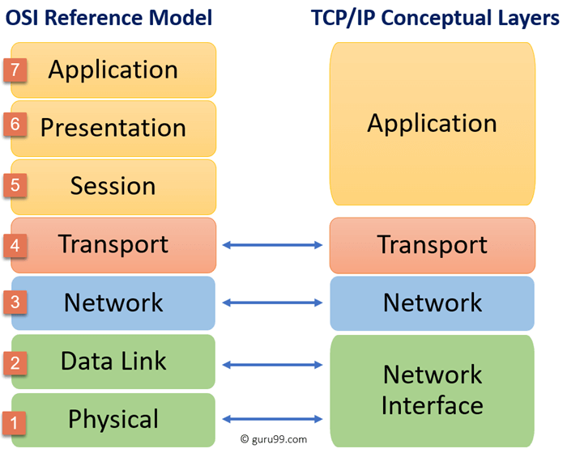

# TCP/IP Model

TCP/IP is a layered server architecture system in which each layer is defined according to a specific function to perform. All these four TCP IP layers work collaboratively to transmit the data from one layer to another.

* Application Layer
* Transport Layer
* Internet Layer
* Network Interface

<figure><figcaption></figcaption></figure>

### Application Layer

Application layer interacts with an application program, which is the highest level of OSI model. The application layer is the OSI layer, which is closest to the end-user. It means the OSI application layer allows users to interact with other software application.

Application layer interacts with software applications to implement a communicating component. The interpretation of data by the application program is always outside the scope of the OSI model.

Example of the application layer is an application such as file transfer, email, remote login, etc.

#### The function of the Application Layers are:

* Application-layer helps you to identify communication partners, determining resource availability, and synchronizing communication.
* It allows users to log on to a remote host
* This layer provides various e-mail services
* This application offers distributed database sources and access for global information about various objects and services.

### Transport Layer 

Transport layer builds on the network layer in order to provide data transport from a process on a source system machine to a process on a destination system. It is hosted using single or multiple networks, and also maintains the quality of service functions.

It determines how much data should be sent where and at what rate. This layer builds on the message which are received from the application layer. It helps ensure that data units are delivered error-free and in sequence.

Transport layer helps you to control the reliability of a link through flow control, error control, and segmentation or de-segmentation.

The transport layer also offers an acknowledgment of the successful data transmission and sends the next data in case no errors occurred. TCP is the best-known example of the transport layer.

#### Important functions of Transport Layers:

* It divides the message received from the session layer into segments and numbers them to make a sequence.
* Transport layer makes sure that the message is delivered to the correct process on the destination machine.
* It also makes sure that the entire message arrives without any error else it should be retransmitted.

### Internet Layer 

An internet layer is a second layer of TCP/IP layes of the TCP/IP model. It is also known as a network layer. The main work of this layer is to send the packets from any network, and any computer still they reach the destination irrespective of the route they take.

The Internet layer offers the functional and procedural method for transferring variable length data sequences from one node to another with the help of various networks.

Message delivery at the network layer does not give any guaranteed to be reliable network layer protocol.

Layer-management protocols that belong to the network layer are:

1. Routing protocols
2. Multicast group management
3. Network-layer address assignment.

### The Network Interface Layer 

Network Interface Layer is this layer of the four-layer TCP/IP model. This layer is also called a network access layer. It helps you to defines details of how data should be sent using the network.

It also includes how bits should optically be signaled by hardware devices which directly interfaces with a network medium, like coaxial, optical, coaxial, fiber, or twisted-pair cables.

A network layer is a combination of the data line and defined in the article of OSI reference model. This layer defines how the data should be sent physically through the network. This layer is responsible for the transmission of the data between two devices on the same network.

### Differences between OSI and TCP/IP

| OSI Model                                                                                                                                                     | TCP/IP model                                                                                     |
| ------------------------------------------------------------------------------------------------------------------------------------------------------------- | ------------------------------------------------------------------------------------------------ |
| It is developed by ISO (International Standard Organization)                                                                                                  | It is developed by ARPANET (Advanced Research Project Agency Network).                           |
| OSI model provides a clear distinction between interfaces, services, and protocols.                                                                           | TCP/IP doesn’t have any clear distinguishing points between services, interfaces, and protocols. |
| OSI refers to Open Systems Interconnection.                                                                                                                   | TCP refers to Transmission Control Protocol.                                                     |
| OSI uses the network layer to define routing standards and protocols.                                                                                         | TCP/IP uses only the Internet layer.                                                             |
| OSI follows a vertical approach.                                                                                                                              | TCP/IP follows a horizontal approach.                                                            |
| [OSI model](https://www.guru99.com/layers-of-osi-model.html) use two separate layers physical and data link to define the functionality of the bottom layers. | TCP/IP uses only one layer (link).                                                               |
| OSI layers have seven layers.                                                                                                                                 | TCP/IP has four layers.                                                                          |
| OSI model, the transport layer is only connection-oriented.                                                                                                   | A layer of the TCP/IP model is both connection-oriented and connectionless.                      |
| In the OSI model, the data link layer and physical are separate layers.                                                                                       | In TCP, physical and data link are both combined as a single host-to-network layer.              |
| Session and presentation layers are not a part of the TCP model.                                                                                              | There is no session and presentation layer in TCP model.                                         |
| It is defined after the advent of the Internet.                                                                                                               | It is defined before the advent of the internet.                                                 |
| The minimum size of the OSI header is 5 bytes.                                                                                                                | Minimum header size is 20 bytes.                                                                 |
